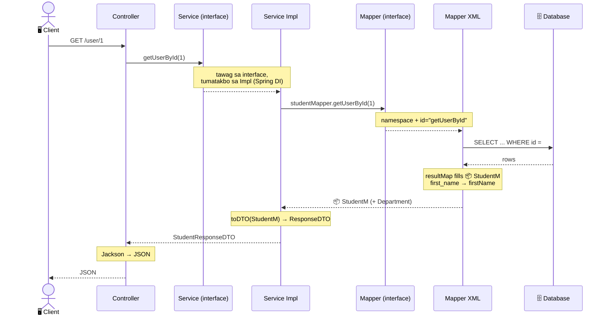
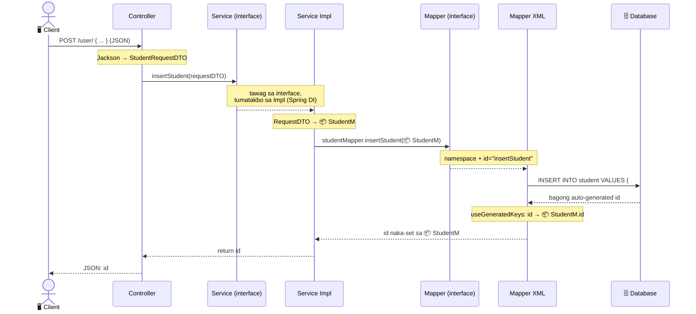
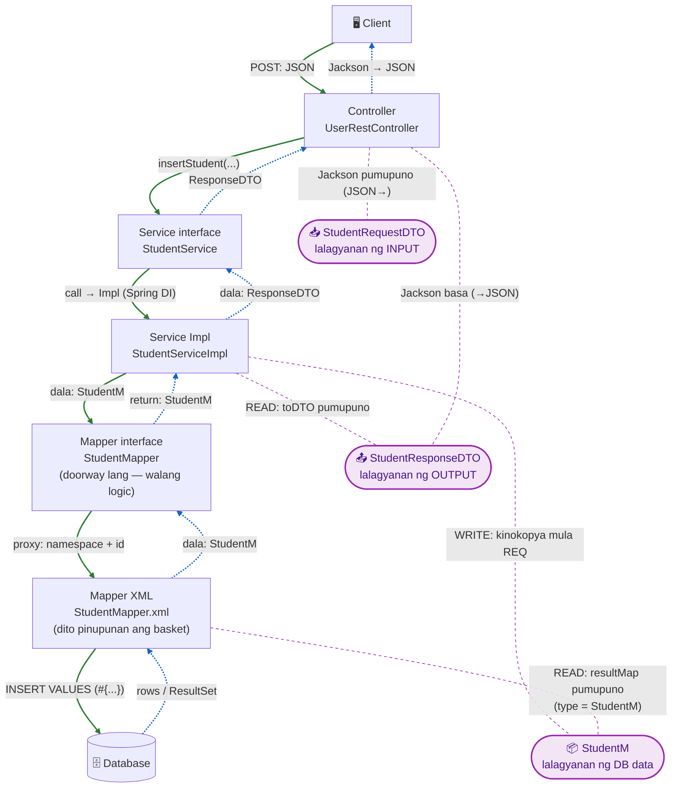

# Diagram Options — READ + WRITE Flow (kumpletong layers)

Dalawang paraan, pero **kompleto na lahat ng layer**: Controller → Service **interface** → Service Impl → Mapper **interface** → Mapper XML → Database, kasama ang **Model (`StudentM`)** na siyang object na dumadaan/pinupunan.

> 📦 = ang Model (`StudentM`) — ito ang basket na hawak ng data habang naglalakbay.

---

## OPTION 1 — Hiwalay (dalawang `sequenceDiagram`)

### 1A. READ — `GET /user/1` (database → balik sa client)



### 1B. WRITE — `POST /user/` (client nagbigay ng data → database)



**Pros:** napakalinaw, kompleto ang layers, madaling sundan.
**Cons:** dalawang diagram.

---

## OPTION 2 — Pinagsama (isang color-coded `flowchart`)

> 🟢 Berde solid = WRITE (pababa). 🔵 Asul dotted = READ (paakyat).
> Ang **`StudentM` (📦)** ay HINDI istasyon — siya ang **cargo/produkto** na nilikha ng XML at sumasakay sa return path paakyat. Kaya nakadikit siya sa **return arrows**, hindi sa gitna.

> Ang mga **kahon na hugis-kapsula (🟣)** = **lalagyanan/template lang** (POJO): `RequestDTO`, `StudentM`, `ResponseDTO`. Hindi sila istasyon — pinupunan lang sila sa isang layer, tapos dinadala.



**Legend:**
- 🟢 **Green solid (pababa)** = WRITE / `POST`.
- 🔵 **Blue dotted (paakyat)** = READ / `GET`.
- 🟣 **Purple capsule** = **lalagyanan/template** (POJO). Ang dashed purple na linya ay nagtuturo **saan pinupunan** ang bawat basket.

### Bakit kahon (lalagyanan) ang DTO at StudentM?

Lahat sila ay **POJO = basket lang ng data** (fields + getters/setters). Hindi sila gumagawa ng logic; **pinupunan** lang sila:
- **`StudentRequestDTO`** — pinupunan ni **Jackson** mula sa papasok na JSON.
- **`StudentM`** — pinupunan ng **XML** (READ) o ng **Impl** (WRITE).
- **`StudentResponseDTO`** — pinupunan ng **Impl** (`toDTO`), babasahin ni Jackson para gawing JSON.

### Paano "kumukuha ng lalagyanan" ang XML sa Model?

Sa READ, **hindi gumagawa ang XML ng sarili nitong klase** — **hinihiram/kinukuha** lang nito ang hugis ng lalagyanan mula sa **Model (`StudentM`)** sa pamamagitan ng `type` sa resultMap:

```xml
<resultMap id="studentResultMap" type="com.pup.taguig.app.model.StudentM">
    <result column="first_name" property="firstName"/>
    ...
</resultMap>
```

- `type="...StudentM"` = **"ito ang lalagyanan na gagamitin ko."** Dito tumitingin ang MyBatis kung anong basket ang bubuuin (`new StudentM()`).
- `property="firstName"` = **"ito ang slot sa basket na pupunan ko"** (via setter `setFirstName(...)`).
- `column="first_name"` = **"galing dito sa DB ang ilalagay."**

💡 Kaya: ang **Model (`StudentM`)** ang nagbibigay ng **disenyo ng lalagyanan**; ang **XML** ang **pumupuno** nito gamit ang DB data. Walang logic ang model — basket lang siya na tinutukoy ng XML.

**Bakit walang "model" box sa gitna ng interface at XML?** Kasi ang `StudentM` ay ang **dala** (cargo), hindi istasyon. Nilikha ito sa XML (gamit ang disenyo galing Model), dala paakyat (XML → interface → impl). Ang **Mapper interface** ay daanan lang — `StudentM getUserById(...)` ang signature, pero **XML** ang aktwal na pumupuno.

**Pros:** isang diagram, kompleto ang layers + model.
**Cons:** mas siksik; sundan ang kulay.

---

## Paghahambing

| | Option 1 (hiwalay) | Option 2 (pinagsama) |
|---|---|---|
| Layers | kompleto (7 participant + model sa note) | kompleto (8 node kasama model) |
| Linaw | ⭐⭐⭐ pinaka-malinaw | ⭐⭐ ok, basta sundan kulay |
| Laki | mahaba (2 diagram) | compact (1 diagram) |
| Best para sa | pag-aaral / presentation | quick reference |

➡️ **Sabihin mo lang kung alin** (o pareho — Option 2 overview sa taas, Option 1 detalye sa baba), ipapasok ko sa `MYBATIS_FLOW.md`.
