# MyBatis REST API — Complete Flow (Controller → XML)

**Project:** `com.pup.taguig.app`
**Layunin:** Ipakita ang buong daloy ng program — mula Controller hanggang MyBatis XML — kung anong **method/id** ang tinatawag at **saan** napupunta ang execution.
**Para kanino:** developer na bago pa sa codebase.

> ✅ tama · ⚠️ correction · 💡 dagdag-paliwanag

---

## 1. Mental Model muna: lahat ay "basket" (POJO)

Bago ang diagram, intindihin ang dalawang termino na paulit-ulit:

**POJO** = *Plain Old Java Object*. Simpleng class na puro **fields + getters/setters**, walang espesyal na logic. Parang **basket / lalagyan** lang ng data.

Sa app na ito, **TATLONG basket** ang importante — pareho silang POJO, magkaiba lang ang trabaho:

| Basket (POJO) | Saan nakatira | Trabaho |
|---|---|---|
| **`StudentRequestDTO`** | API boundary (papasok) | Sasalo ng input galing UI (`@RequestBody`). |
| **`StudentM`** | loob ng app (internal) | Holder ng data papunta/galing **database**. |
| **`StudentResponseDTO`** | API boundary (palabas) | Ang ihahain pabalik sa UI (gagawing JSON). |

💡 Sino ang naglilipat ng laman sa pagitan ng mga basket?
- **`StudentServiceImpl`** = ang **tagaluto** — kinukuha niya ang laman ng isang basket at inilalagay sa iba.
- **MyBatis XML** = ang **tagapuno ng `StudentM`** mula sa database row (at kabaligtaran sa insert).
- **Jackson (Spring)** = ang **tagagawa ng JSON** mula sa `ResponseDTO`.

---

## 2. Flow Diagrams

May dalawang direksyon ang daloy. **READ** = kumukuha ng data (DB → UI). **WRITE** = nagbibigay ng data (UI → DB).

### 2A. READ flow — `GET /user/1` (database → balik sa client)

Hingi ng client ng data; binabalik ng database pataas hanggang maging JSON.

```mermaid
sequenceDiagram
    actor UI as 🖥️ UI / Client
    participant C as Controller<br/>UserRestController
    participant S as Service (interface)<br/>StudentService
    participant I as Service Impl<br/>StudentServiceImpl
    participant M as Mapper (interface)<br/>StudentMapper
    participant X as Mapper XML<br/>StudentMapper.xml
    participant DB as 🗄️ Database

    UI->>C: GET /user/1
    Note over C: @GetMapping("/{id}")<br/>id = 1
    C->>S: studentService.getUserById(1)
    Note over S,I: tawag sa interface,<br/>tumatakbo sa Impl (Spring DI)
    S-->>I: resolved at runtime
    I->>M: studentMapper.getUserById(1)
    Note over M,X: bound by<br/>namespace + id="getUserById"
    M-->>X: matches <select id="getUserById">
    X->>DB: SELECT ... WHERE s.id = #{id}
    DB-->>X: rows (ResultSet)
    Note over X: resultMap fills StudentM<br/>first_name → firstName ...
    X-->>I: 📦 StudentM (+ Department)
    Note over I: toDTO(studentM)<br/>StudentM → StudentResponseDTO
    I-->>C: StudentResponseDTO
    Note over C: Jackson serializes<br/>object → JSON
    C-->>UI: JSON response
```



### 2B. WRITE flow — `POST /user/` (client nagbigay ng data → database)

Nagbibigay ang client ng bagong student (JSON); dumadaloy pababa hanggang **maisulat sa database**, tapos ibinabalik ang bagong-generate na `id`.

```mermaid
sequenceDiagram
    actor UI as 🖥️ UI / Client
    participant C as Controller<br/>UserRestController
    participant S as Service (interface)<br/>StudentService
    participant I as Service Impl<br/>StudentServiceImpl
    participant M as Mapper (interface)<br/>StudentMapper
    participant X as Mapper XML<br/>StudentMapper.xml
    participant DB as 🗄️ Database

    UI->>C: POST /user/ { firstName, lastName, ... } (JSON)
    Note over C: @PostMapping("/")<br/>Jackson: JSON → StudentRequestDTO
    C->>S: studentService.insertStudent(requestDTO)
    S-->>I: tawag sa interface, tumatakbo sa Impl (Spring DI)
    Note over I: bagong StudentM;<br/>request.getFirstName() → student.setFirstName()<br/>(RequestDTO → StudentM)
    I->>M: studentMapper.insertStudent(studentM)
    Note over M,X: bound by<br/>namespace + id="insertStudent"
    M-->>X: matches <insert id="insertStudent">
    X->>DB: INSERT INTO student (...) VALUES (#{firstName}, ...)
    DB-->>X: bagong auto-generated id
    Note over X: useGeneratedKeys<br/>id → studentM.id
    X-->>I: id naitakda sa StudentM
    I-->>C: return Long id
    C-->>UI: JSON: id
```

💡 **Pansinin:** sa READ, ang data ay **umaakyat** (DB → StudentM → DTO → JSON). Sa WRITE, ang data ay **bumababa** (JSON → RequestDTO → StudentM → SQL → DB), at ang **id lang** ang umaakyat pabalik.

💡 **Dalawang "tahimik" na binding** (pareho sa magkabilang diagram):
1. **interface → impl:** tinatawag ng controller ang **`StudentService` (interface)**, hindi diretso ang impl. Si Spring ang nag-inject ng impl (`@Autowired`).
2. **mapper → XML:** walang implementation class na isinulat. Idinudugtong ni MyBatis ang method sa `<select>`/`<insert>` gamit ang **namespace + id**.

---

## 3. Layer-by-Layer

### 3.1 Controller — `UserRestController.java`

Dito nakalatag ang **API routes** gamit ang Spring Web annotations:

| Annotation | Method | Route | Gamit |
|---|---|---|---|
| `@GetMapping("/{id}")` | `getUsersById` | `GET /user/1` | isang student |
| `@GetMapping("/")` | `getAllUsers` | `GET /user/` | lahat |
| `@PostMapping("/")` | `addStudent` | `POST /user/` | mag-insert (`@RequestBody`) |
| `@DeleteMapping("/{id}")` | `deleteStudent` | `DELETE /user/1` | mag-delete |

- **`@PathVariable` / `@RequestBody`** = ang nag-extract ng data sa HTTP request.
- **`@Autowired StudentService`** = "isinalpak" (injected) na serbisyo — hindi gumagawa ang controller ng sariling logic, pinapasa lang.

⚠️ Walang aktibong **edit/`PutMapping`** ngayon — naka-comment lang ang update path.

---

### 3.2 Service Interface — `StudentService.java`

Ang **kontrata** (abstraction): listahan ng kaya gawin, walang "paano."
```java
StudentResponseDTO getUserById(Long id);
List<StudentResponseDTO> retrieveAllStudent();
Long insertStudent(StudentRequestDTO student);
boolean deleteStudentById(Long id);
```
💡 Dahil dito, alam lang ng controller ang interface — pwedeng palitan ang impl nang di siya ginagalaw (**loose coupling**).

---

### 3.3 Service Impl — `StudentServiceImpl.java`  ← ang "tagaluto"

✅ Tama ang pagkakaintindi mo: **kumukuha siya ng ingredients at siya ang nagco-compile/nag-aassemble.**

**Read (palabas)** — kinukuha ang `StudentM`, ginagawang DTO:
```java
StudentM s = studentMapper.getUserById(id);   // kumuha ng ingredient (DB → StudentM)
return toDTO(s);                              // i-assemble (StudentM → StudentResponseDTO)
```

**Insert (papasok)** — kinukuha ang laman ng RequestDTO, inilalagay sa `StudentM`:
```java
StudentM student = new StudentM();
student.setFirstName(request.getFirstName());  // RequestDTO → StudentM
...
studentMapper.insertStudent(student);          // ipasa sa mapper para isulat sa DB
```

💡 So ang impl ang **naglilipat ng laman sa pagitan ng mga basket** at siya ang may hawak ng business logic.

---

### 3.4 DTO — ang mga "basket" sa API boundary

⚠️ Linaw sa naunang pagkakaintindi: ang **DTO ay HINDI nagco-convert ng JSON.** Basket lang siya (POJO). Si **Jackson** ang nagco-convert ng `ResponseDTO` → JSON kapag nag-`return` na ang controller.

```
StudentM ──impl.toDTO()──► StudentResponseDTO ──controller return──► Jackson ──► JSON ──► UI
```

💡 **Bakit may DTO kung may `StudentM` na?** Para **hindi direktang ma-expose ang internal model/DB shape** sa labas. Ikaw ang pumipili kung anong fields lang ang papasok/lalabas (**DTO pattern**).

---

### 3.5 Model — `StudentM.java`  ← holder din (POJO)

✅ Tama: **holder/basket din ang `StudentM`** — plain POJO (`@Getter/@Setter`) na hawak ng data papunta/galing DB. Ito ang nakasaad sa XML bilang `resultMap type="...model.StudentM"`.

💡 Encapsulation: dahil object na ang hawak (hindi raw column), itinatago nito ang aktwal na structure ng database sa mga upper layer.
💡 May **nested `Department`** sa loob ng `StudentM` (galing `LEFT JOIN departments` + `<association>`).

---

### 3.6 Mapper Interface — `StudentMapper.java`

`@Mapper` interface — **method names lang, walang SQL.**
```java
StudentM getUserById(Long id);
List<StudentM> retrieveAllStudent();
Long insertStudent(StudentM student);
int deleteStudentById(Long id);
```
💡 Walang implementation class — si MyBatis ang gumagawa nito at idinudugtong sa SQL via **namespace + id**.
⚠️ May `addUser` / `insertUser` na **walang SQL** sa XML — pwedeng linisin.

---

### 3.7 Mapper XML — `StudentMapper.xml`  ← ang "tagapuno ng `StudentM`"

✅ Tama ang tanong mo: **ang purpose ng XML mapper ay punuin (populate) ang `StudentM` model.**

**(a) `<resultMap>` — column → property** (snake_case DB → camelCase Java):
```xml
<resultMap id="studentResultMap" type="com.pup.taguig.app.model.StudentM">
    <id     column="stud_id"       property="id"/>
    <result column="first_name"    property="firstName"/>     <!-- snake → camel -->
    <result column="midterm_grade" property="midtermGrade"/>
    <association property="department" resultMap="departmentResultMap"/>
</resultMap>
```
- **kaliwa** (`column`) = pangalan sa **database**
- **kanan** (`property`) = pangalan sa **`StudentM`**

⚠️ Hindi "camelCase → PascalCase" — ito ay **snake_case → camelCase**.

**(b) Ang aktwal na SQL:**
```xml
<select id="getUserById" resultMap="studentResultMap">
    SELECT s.id AS stud_id, s.first_name, ...
    FROM student s LEFT JOIN departments d ON s.department_id = d.id
    WHERE s.id = #{id}        <!-- #{id} = value galing argument; safe (prepared statement) -->
</select>

<insert id="insertStudent" useGeneratedKeys="true" keyProperty="id">
    INSERT INTO student (first_name, ...) VALUES (#{firstName}, ...)
    <!-- pagka-insert, ibinabalik ang bagong DB id pabalik sa StudentM.id -->
</insert>
```
💡 Two-way: **SELECT** (DB → punuin ang `StudentM`) at **INSERT** (kunin laman ng `StudentM` → isulat sa DB).

---

## 4. Buong daloy ng bawat endpoint

| Endpoint | Controller | Service | XML id | SQL |
|---|---|---|---|---|
| `GET /user/{id}` | `getUsersById` | `getUserById` | `getUserById` | SELECT + JOIN, `WHERE id` |
| `GET /user/` | `getAllUsers` | `retrieveAllStudent` | `retrieveAllStudent` | SELECT + JOIN (lahat) |
| `POST /user/` | `addStudent` | `insertStudent` | `insertStudent` | INSERT |
| `DELETE /user/{id}` | `deleteStudent` | `deleteStudentById` | `deleteStudentById` | DELETE |

---

## 5. Summary

| # | Linaw |
|---|---|
| 1 | **POJO = basket** ng data (fields + getters/setters). Pareho POJO ang `StudentM` at DTO — magkaiba ang trabaho. |
| 2 | **Impl = tagaluto:** kumukuha ng ingredients (`StudentM`) at nag-aassemble ng DTO. ✅ |
| 3 | **`StudentM` = holder** ng DB data (internal). ✅ |
| 4 | **XML mapper = tagapuno ng `StudentM`** (SELECT) / tagakuha ng laman nito (INSERT). ✅ |
| 5 | **DTO ≠ JSON converter** — si Jackson 'yon. DTO ay basket lang. |
| 6 | XML mapping ay **snake_case → camelCase**, hindi PascalCase. |
| 7 | Tahimik na binding: **interface→impl** (`@Autowired`) at **mapper→XML** (namespace + id). |

> **Isang linya:** UI → Controller (basket in/out) → Service interface (kontrata) → Impl (tagaluto: DTO⇄StudentM) → Mapper interface → XML (tagapuno ng StudentM + SQL) → DB → balik.
