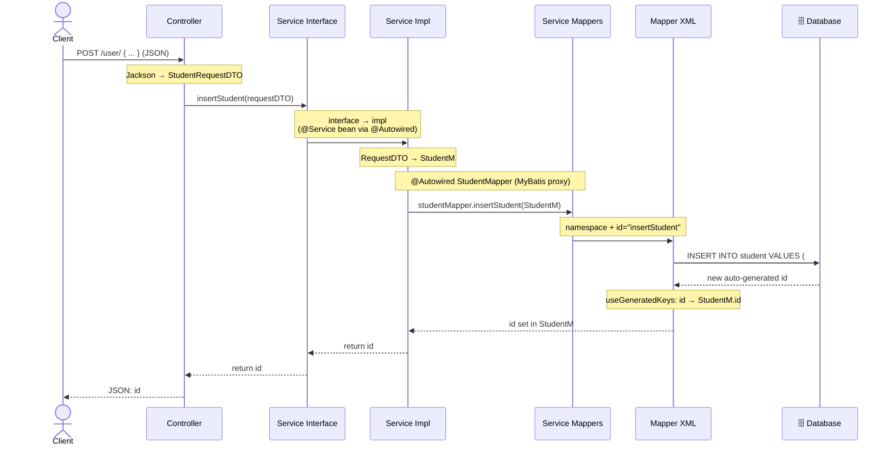
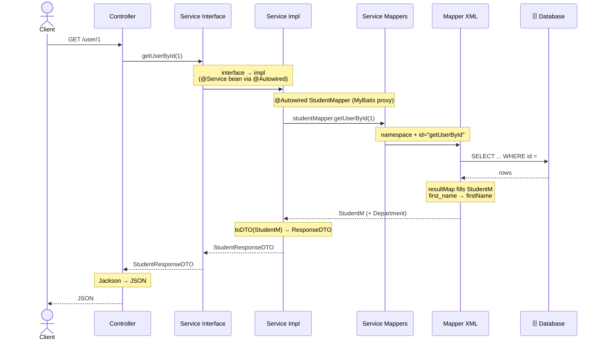

# REST Flow — WRITE and READ

The participants in both diagrams:

| Participant | Role |
|---|---|
| **Client** | Sends the HTTP request, receives the JSON response. |
| **Controller** | Entry point; maps JSON ⇄ DTO and delegates to the service. |
| **Service Interface** | The contract — declares what can be called. |
| **Service Impl** | The logic; converts DTO ⇄ `StudentM`. |
| **Service Mappers** | The mapper interface; its MyBatis proxy resolves the SQL. |
| **Mapper XML** | The actual SQL statements and the `resultMap`. |
| **Database** | Stores and returns rows; auto-generates the id. |

`StudentRequestDTO`, `StudentM`, and `StudentResponseDTO` are just data objects that hold
fields and are passed between layers.

---

## 1. WRITE — `POST /user/`

**Step by step:**
1. Client sends JSON; the Controller uses Jackson to turn it into a `StudentRequestDTO`.
2. Controller calls `insertStudent(requestDTO)` on the Service Interface.
3. The call runs in the Service Impl (the `@Service` bean injected via `@Autowired`).
4. The Impl copies the DTO fields into a new `StudentM`.
5. It calls `studentMapper.insertStudent(StudentM)`; the proxy maps it to the XML by `namespace + id`.
6. The XML runs the `INSERT` — this SQL is **written by hand** (MyBatis is customizable, not auto-generated like a full ORM); the database generates a new id.
7. With `useGeneratedKeys`, that id is written back into `StudentM`.
8. The id is returned up the chain and the Controller sends it back as JSON.

---

## 2. READ — `GET /user/1`

**Step by step:**
1. Client sends `GET /user/1`; the Controller calls `getUserById(1)` on the Service Interface.
2. The call runs in the Service Impl.
3. The Impl calls `studentMapper.getUserById(1)`; the proxy maps it to the XML by `namespace + id`.
4. The XML runs the `SELECT` — the query is **written by hand** in the XML (MyBatis is customizable: you control the exact SQL, not auto-generated like a full ORM); the database returns the rows.
5. The `resultMap` — also **defined by you** — **converts the raw rows into a `StudentM` object**. This is also where the naming styles are bridged: the database columns are **`snake_case`** (`first_name`, `midterm_grade`) while the Java object fields are **`camelCase`** (`firstName`, `midtermGrade`), so each `<result column="first_name" property="firstName"/>` maps one to the other. The nested `Department` object is filled the same way.
6. The Impl converts the `StudentM` into a `StudentResponseDTO` via `toDTO`.
7. The DTO goes up to the Controller, which turns it into JSON and returns it.

---

## In Short

- The **Controller** only receives the request and returns the response (JSON ⇄ DTO).
- The **Service Interface** is just a contract — it declares the methods but holds no logic; `@Autowired` injects the implementation in its place.
- The **Service Impl** does the real work: it builds/converts the data objects.
- The **Mapper interface** (Service Mappers) also holds no logic; its MyBatis proxy maps each method to an XML statement by `namespace + id`.
- The **Mapper XML** is the only layer that runs SQL against the database.
- The **DTOs** (`StudentRequestDTO` for input, `StudentResponseDTO` for output) and **`StudentM`** just carry data between the layers — the Impl converts DTO ⇄ `StudentM`.
